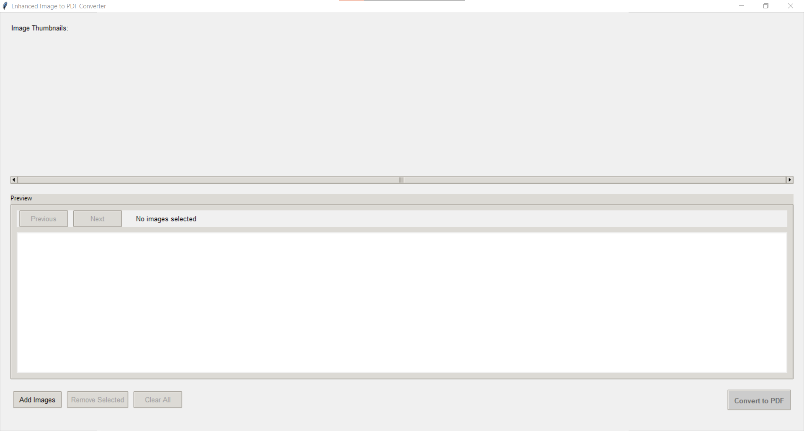

# 📸 Image to PDF Converter

[](https://www.python.org)
[](LICENSE)
[](CONTRIBUTING.md)

A modern, user-friendly desktop application for converting images to PDF files. Built with Python and Tkinter, this application provides a seamless experience for creating PDFs from your images with advanced features like drag-and-drop support, image rotation, and batch processing.



## ✨ Features

- 🖱️ Drag and drop support for easy image importing
- 🔄 Image rotation and reordering capabilities
- 👁️ Real-time image preview with thumbnails
- 📊 Progress tracking during conversion
- 📱 Responsive and modern UI design
- 🎨 Batch processing support
- ⚡ Fast and efficient conversion
- 🔍 Image preview before conversion
- 🛡️ Error handling and validation
- 💾 Support for multiple image formats (JPG, PNG, BMP, TIFF)

## 🚀 Installation

### Prerequisites

- Python 3.8 or higher
- pip (Python package manager)

### Dependencies

```bash
pip install Pillow tkinterdnd2
```

### Running the Application

1. Clone the repository:
```bash
git clone https://github.com/nethinduhansaka-dev/image-to-pdf-converter.git
cd image-to-pdf-converter
```

2. Install required packages:
```bash
pip install -r requirements.txt
```

3. Run the application:
```bash
python index.py
```

## 🎯 Usage

1. **Adding Images**:
   - Click the "Add Images" button to select files
   - Or drag and drop images directly into the application window
   - Supported formats: JPG, JPEG, PNG, BMP, TIFF

2. **Managing Images**:
   - Click on thumbnails to select/deselect images
   - Use rotation buttons (↶, ↷) to rotate images
   - Remove selected images using the "Remove Selected" button
   - Clear all images using the "Clear All" button

3. **Converting to PDF**:
   - Click "Convert to PDF" button
   - Choose destination folder and filename
   - Wait for conversion to complete
   - Open the generated PDF (optional)

## ⌨️ Keyboard Shortcuts

| Shortcut | Action |
|----------|---------|
| `Ctrl+O` | Open/Add Images |
| `Delete` | Remove Selected Images |
| `Ctrl+C` | Clear All Images |
| `Ctrl+S` | Save as PDF |
| `←` | Previous Image |
| `→` | Next Image |
| `R` | Rotate Right 90° |
| `L` | Rotate Left 90° |
| `Escape` | Clear Selection |

## 🔧 Technical Details

Built with:
- Python 3.8+
- Tkinter/TkinterDnD2 for GUI
- Pillow (PIL) for image processing
- Threading for background processing

## 📝 Contributing

Contributions are welcome! Please feel free to submit a Pull Request. For major changes, please open an issue first to discuss what you would like to change.

1. Fork the repository
2. Create your feature branch (`git checkout -b feature/AmazingFeature`)
3. Commit your changes (`git commit -m 'Add some AmazingFeature'`)
4. Push to the branch (`git push origin feature/AmazingFeature`)
5. Open a Pull Request

## 📜 License

This project is licensed under the MIT License - see the [LICENSE](LICENSE) file for details.

## 👥 Authors

- **Your Name** - *Initial work* - [YourGitHub](https://github.com/nethinduhansaka-dev)

## 🙏 Acknowledgments

- Thanks to all contributors who have helped this project grow
- Pillow library developers
- TkinterDnD2 developers

## 📞 Support

If you encounter any problems or have suggestions, please [open an issue](https://github.com/nethinduhansaka-dev/image-to-pdf-converter/issues) on GitHub.

---
Made with ❤️ by [nethinduhansaka-dev]
